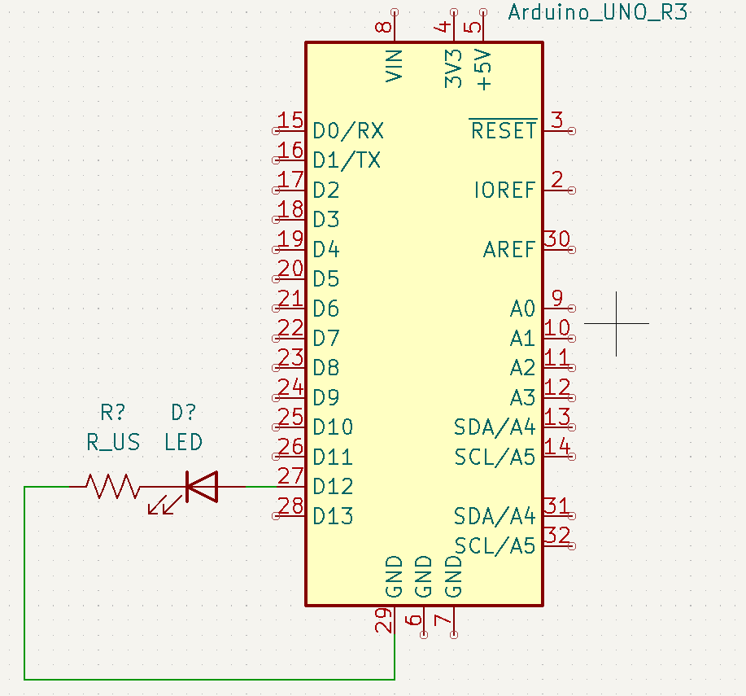

# Haciendo parpadear un LED. Primer proyecto con Arduino

<figure markdown>
  
  <figcaption>LED parpadeando - Resultado</figcaption>
</figure>

El objetivo de esta guía será tener una primera experiencia con arduino, tanto en lado del hardware como en el del software; es decir, esta guía abarca tanto como montar un circuito básico con arduino como programar este circuito para que funcione como nosotos deseamos.

## Montaje
La práctica se puede realizar con el led interno del Arduino, que está conectado al pin 13, o utilizando uno externo. El siguiente esquema muestra la conexión de un led al Arduino
<figure markdown>
  
  <figcaption>Esquema de montaje con un led externo</figcaption>
</figure>
Para conectar un led al Arduino necesitaremos una resistencia, ya que el arduino funciona a 5V, y si no lo fundiremos. Un valor típico para esta resistencia sería de alrededor de 220Ω. Para montar el esquema tendremos que conectar el positivo del led *(pata larga)*, el pin 12 del Arduino, en este caso, y la negativa *(pata corta)* a tierra a través de la resistencia.

## Programa

El programa deberá de hacer parpadear el led, encendiéndolo y apagándolo en un bucle. El diagrama de flujo del programa es el siguiente:

<figure markdown>
  ```mermaid
  flowchart TD
  A([Inicio]) --> B[Encender el led]
  B --> |Esperar 1000ms| C[Apagar el led]
  C --> |Esperar 1000ms| B
  ```
  <figcaption>Esquema de flujo del programa</figcaption>
</figure>

Para ello, crearemos un sketch nuevo en el ide de arduino. Haz clic en los :material-plus-circle: para ver qué hace cada parte

```arduino title="parpadeo_led.ino" linenums="1"
const int led = 13;  // El led está conectado al pin 13 (3)

void setup () { // Función Inicial (1)
  pinMode(led, OUTPUT);  // El led es una salida (4)
}

void loop () {  // Bucle Principal (2)
  digitalWrite(led, HIGH);  // Encender el led (5)
  delay(1000);  // Esperar 1000ms (1 segundo)
  digitalWrite(led, LOW); // Apagar el led
  delay(1000);  // Esperar 1000ms (1 segundo)
}
```

1. El `void setup` es la función inicial de arduino, que se ejecuta una sola vez al inicio del programa, al arrancar o reiniciar el arduino
2. El `void loop` es la función principal de arduino, que se ejecuta en bucle desde que se arranca el arduino, justo después del `void setup`. En esta función escribiremos aquellas instrucciones que queremos que se ejecuten repetidamente mientras que el arduino esté encendido
3. Al principio definimos el led, indicando en qué pin está conectado
4. Ahora indicamos que es una salida
5. El LED es una salida digital, que podrá estar encendida,  *==HIGH==*, o apagada,  *==LOW==*

Ahora que conocemos el código del programa y tenemos el circuito montado, podemos conectar el arduino al ordenador con el cable USB tipo B y cargar el programa tocando en la flecha :material-arrow-right-bold-circle: en el ide de arduino o con el atajo de teclado ++ctrl+u++

<small>
  :octicons-light-bulb-16:
  **Tip:** Puedes hacer clic en el icono :material-check-circle: para verificar el programa antes de subirlo. El IDE nunca cargará un programa erróneo, ya que no se podrá compilar, pero de esta manera puedes comprobar el programa sin tener que conectar el Arduino al ordenador.
</small>

!!! example "Practica con lo aprendido"
    Prueba a modificar el programa para que funcione de manera diferente, estas son algunas ideas:

    - Modifica los intervalos
    - Crea un patrón, por ejemplo, largo-corto-largo-corto-corto
    - Añade otro led, puedes utilizar el integrado en el arduino o añadir otro
