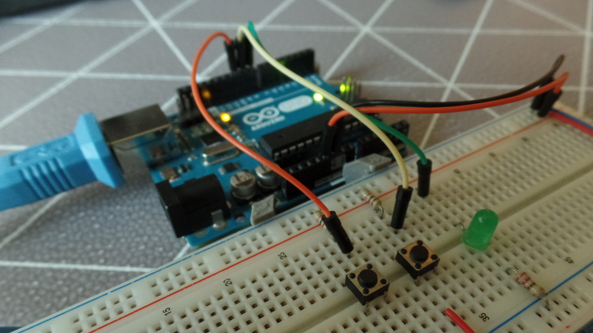

# El pulsador. Los condicionales

<figure markdown>
  
  <figcaption>Montaje del esquema con dos pulsadores y un led</figcaption>
</figure>

En esta práctica se introducen las entradas digitales mediante los pulsadores, con dos ejemplos, con un único pulsador y con dos.

## Ejemplo I
### Montaje


### Diagrama
<figure markdown>
  ```mermaid
  flowchart TD
  A([Inicio]) --> B{"¿Pulsador activado?"}
  B -->|Sí| C[Encender LED]
  B -->|No| D[Apagar el led]
  C & D --> E([Fin])
  E -.-> A
  ```
  <figcaption>Diagrama del primer ejemplo</figcaption>
</figure>

### Programa
```arduino title="pulsador.ino" linenums="1"
const int led = 9;
const int btn = 8;

void setup () {
    pinMode(led, OUTPUT);
    pinMode(btn, INPUT);
}

void loop () {
    if(digitalRead(btn) == HIGH) {
        digitalWrite(led, HIGH);
    }
    else {
        digitalWrite(led, LOW);
    }
}
```

## Ejemplo II. Operador AND
En este ejemplo, haremos una puerta and con dos pulsadores y un led. Añadimos otro pulsador al circuito anterior, en esta ocasión conectado al pin 10. La tabla de verdad del operador AND es:

| Entrada I | Entrada II | Salida |
| --------- | ---------- | ------ |
|     0     |      0     |   0    |
|     ==1==     |      0     |   0    |
|     0     |      ==1==     |   0    |
|     ==1==     |      ==1==     | ==1== |

<figure markdown>
  ```mermaid
  flowchart TD
  A([Inicio]) --> B{"Dos pulsadores activos"}
  B -->|Sí| C[Encender LED]
  B -->|No| D[Apagar LED]
  C --> F([Fin])
  D --> F
  F -.-> A
  ```
  <figcaption>Diagrama del bucle principal</figcaption>
</figure>

```arduino title="puerta_and.ino" linenums="1"
const int sw1 = 10; // Pulsador 1 en el pin 10
const int sw2 = 9;  // Pulsador 2 en el pin 9
const int led = 8;  // LED en el pin 8

// Variables para almacenar las lecturas de los pulsadores
int lectura1 = 0;
int lectura2 = 0;

void setup() {
  pinMode(sw1, INPUT);  // Los pulsadores son entradas
  pinMode(sw2, INPUT);
  pinMode(led, OUTPUT); // El LED es una salida
}

void loop() {
  // Al inicio del bucle almacenamos los valores de los pulsadores
  lectura1 = digitalRead(sw1); // Lectura digital: (1)
  lectura2 = digitalRead(sw2);

  // Si los dos botones están pulsados
  if(lectura1 == HIGH && lectura2 == HIGH) { // Los condicionales (2) (3)
    digitalWrite(led, HIGH);  // Encendemos el LED
  }
  // En caso contrario
  else {
    digitalWrite(led, LOW); // Apagamos el led
  }
}
```

1. El pulsador es una entrada digital. Por eso, leemos su estado con `digitalRead` y lo almacenamos en una variable. Si el pulsador está activo, la variable equivaldrá a _HIGH_, y si no lo está, su valor será _LOW_
2. Es importante poner dos iguales en las comparaciones, ya que un único igual impone la igualdad, mientras que dos indican que es una comparación
3. Los dos _ampersand_ (_&_), funcionan como el operador lógico _AND_, por lo que la condición solo será verdadera si se cumplen las dos. También se puede escribir dos barras ==||== para el operador lógico _OR_

!!! example "Practica con lo aprendido"
    Ahora puedes probar a convertir la puerta AND del segundo ejemplo en una puerta OR, o en una NOR
