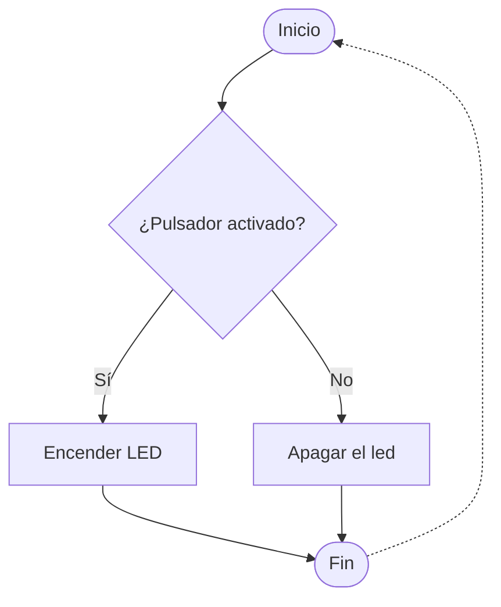
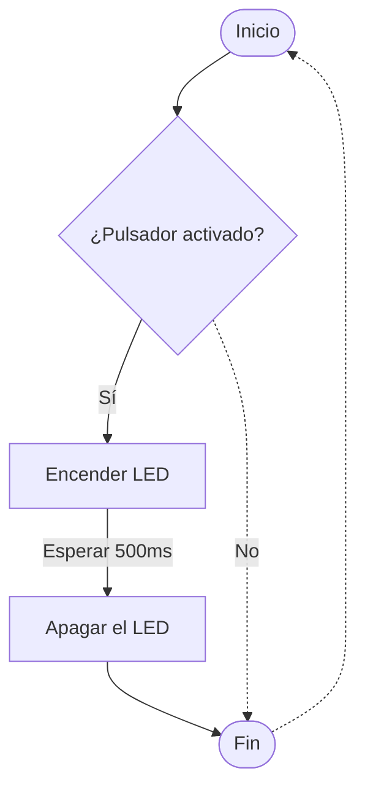

# El pulsador. Los condicionales



```arduino
if (condition == a || condition2 == b && condition3 != c) {
    digitalWrite(led, HiGH);
}
else if (condition4 = a + b) {
    digitalWrite(led, HIGH);
    delay(250);
    digitalWrite(led, LOW);
}
else {
    digitalWrite(led, LOW);
}
```

```arduino title="pulsador.ino" linenums="1"
const int led = 13;
const int btn = 12;

void setup () {
    pinMode(led, OUTPUT);
    pinMode(btn, INPUT);
}

void loop () {
    if(digitalRead(btn) == HIGH) {
        digitalWrite(led, HIGH);
    }
    else {
        digitalWrite(led, LOW);
    }
}
```

## Segundo ejemplo



```arduino title="pulsador.ino" linenums="1"
const int led = 13;
const int btn = 12;

void setup () {
    pinMode(led, OUTPUT);
    pinMode(btn, INPUT);
}

void loop () {
    if(digitalRead(btn) == HIGH) {
        digitalWrite(led, HIGH);
        delay(500);
        digitalWrite(led, LOW);
    }
}
```